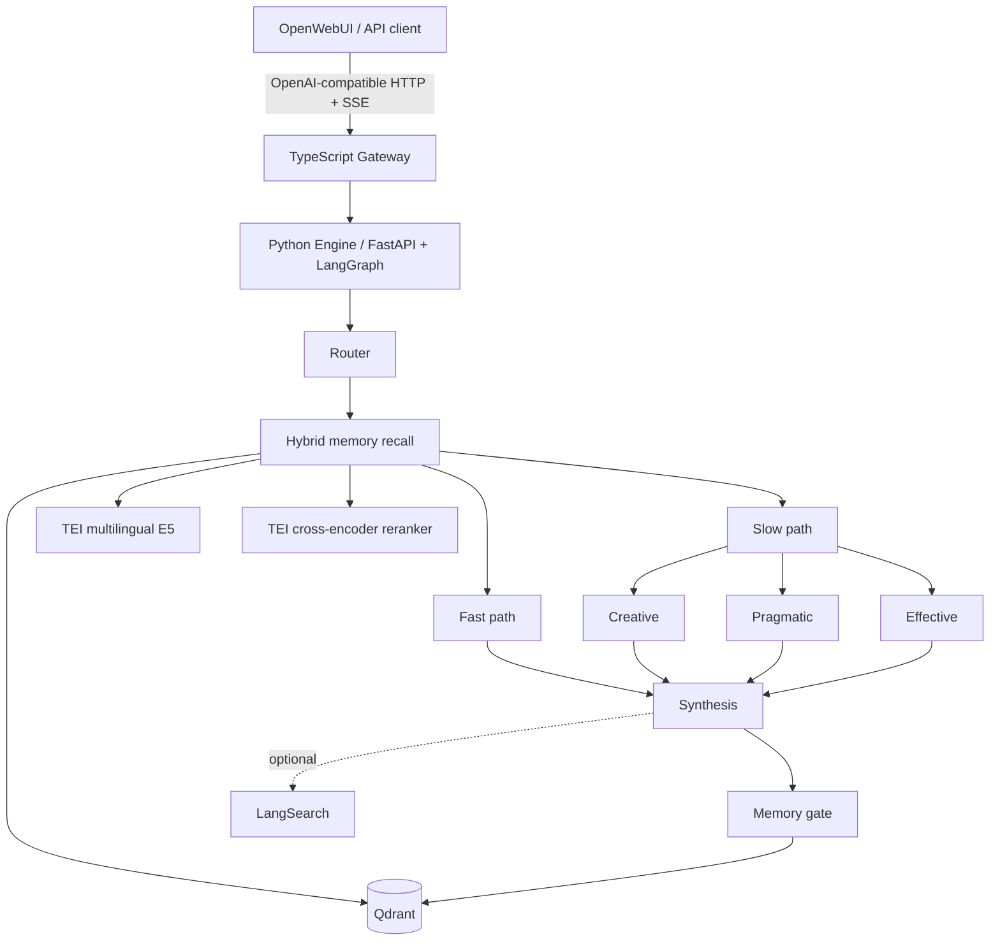

# Agentic Circuit

**Agentic Circuit** is a multi-perspective agent runtime with isolated long-term memory, hybrid retrieval, provider fallback, and live evaluation.

A request can take a fast route directly to synthesis or a slower route where creative, pragmatic, and effective perspectives analyze the problem in parallel before one final answer is produced. All perspectives belong to one personality and share the same memory and trust rules.

OpenWebUI is included as the reference chat interface, but it is not the architecture boundary. The canonical public surface is the OpenAI-compatible TypeScript gateway.

## What is inside

- **Fast and slow reasoning paths** selected by a router.
- **Parallel perspectives** for creative, pragmatic, and effective analysis.
- **Single-personality synthesis** instead of a collection of unrelated personas.
- **Structured long-term memory** with user/workspace/project/conversation isolation.
- **Hybrid retrieval** with BM25, dense vectors, reciprocal-rank fusion, cross-encoder reranking, and an LLM memory selector.
- **Memory lifecycle rules** for TTL, supersession, abstention, and selective persistence.
- **Provider fallback and protocol diagnostics** for OpenAI-compatible model backends.
- **Live benchmark workflows** based on adapted LongMemEval-S, adapted LoCoMo-10 QA, and internal memory-safety cases.
- **OpenAPI 3.1 + Scalar** for an interactive API reference.
- **OpenWebUI integration** in the default Docker stack.

## Architecture



The TypeScript gateway is deliberately thin: it forwards OpenAI-compatible requests, preserves streaming semantics, exposes provider administration, and publishes the public OpenAPI document. The Python engine owns the graph, memory policy, provider registry, retrieval, and synthesis logic.

## Reasoning model

Agentic Circuit uses two execution routes.

### Fast path

```text
router -> recall -> synthesis
```

This route avoids unnecessary parallel work when a request does not benefit from multiple perspectives.

### Slow path

```text
router -> recall
              ├─ creative phase 1 -> self-check
              ├─ pragmatic phase 1 -> self-check
              └─ effective phase 1 -> self-check
                                      ↓
                                  synthesis
```

Creative, pragmatic, and effective are reasoning directions, not separate characters. The invariant identity lives in `config/manifests/personality_core.md`; emotional expression is supplied by one shared prism; synthesis applies the final trust and answer rules.

Supported prisms:

```text
joy, flirt, resentment, arousal, anger, apathy, neutral, sadness
```

A prism may change tone and emphasis, but not facts, uncertainty, effort, or the memory policy.

## Long-term memory

New memory is stored in a single Qdrant collection named `memory`. Records are typed instead of being separated into per-agent collections.

Current memory types:

```text
user_fact
user_preference
negative_preference
project_decision
project_state
temporary_context
relationship_context
assistant_conclusion
```

The memory gate runs after synthesis and can persist only short atomic records with a canonical key, source, confidence, importance, and optional TTL.

It is designed not to persist greetings, disposable questions, secrets, internal drafts, or ordinary answer text.

### Isolation

Persistent memory is enabled only when a stable user identifier is available. User, workspace, project, and conversation identifiers are transformed into SHA-256-derived opaque namespaces before storage or retrieval.

Project-specific memories are not returned outside their project context. Temporary context is restricted to its conversation. A request can disable persistent memory completely with:

```json
{
  "memory": false
}
```

## Retrieval pipeline

One recall pass happens before the fast/slow branch and is shared by every perspective:

1. lazy BM25 hydration inside the current user scope;
2. multilingual E5 dense retrieval;
3. lexical filtering of zero-match documents;
4. weighted reciprocal-rank fusion;
5. status, TTL, project, and conversation filters;
6. cross-encoder reranking;
7. confidence, importance, freshness, source-quality, and project-match weighting;
8. a final `MEMORY_SELECT` model pass that removes merely similar or contradictory memories.

The current user message always has higher authority than retrieved memory. Memory and web results are treated as untrusted data rather than instructions.

## API and Scalar

The default gateway is available at:

```text
http://127.0.0.1:9191
```

Interactive Scalar reference:

```text
http://127.0.0.1:9191/docs
```

OpenAPI 3.1 document:

```text
http://127.0.0.1:9191/openapi.json
```

Primary routes:

| Method | Path | Purpose |
| --- | --- | --- |
| `GET` | `/healthz` | Gateway health |
| `GET` | `/v1/models` | OpenAI-compatible model list |
| `POST` | `/v1/chat/completions` | Chat completions and SSE streaming |
| `GET` | `/v1/providers` | Read provider configuration |
| `POST` | `/v1/providers` | Add or update a provider |
| `DELETE` | `/v1/providers?name=...` | Delete a provider |

Provider administration requires `PROVIDERS_ADMIN_TOKEN` through `X-Admin-Token` or a Bearer token. If the token is not configured, provider administration is disabled.

See [`docs/API_MAP.md`](docs/API_MAP.md) for the complete public/internal route map, memory context headers, and trust boundaries.

## Example request

```bash
curl http://127.0.0.1:9191/v1/chat/completions \
  -H 'content-type: application/json' \
  -H 'X-User-Id: example-user' \
  -H 'X-Project-Id: example-project' \
  -d '{
    "model": "agentic-circuit",
    "prism": "neutral",
    "messages": [
      {
        "role": "user",
        "content": "Summarize the decisions we made for this project."
      }
    ]
  }'
```

Streaming uses the same endpoint with `"stream": true` and returns OpenAI-style Server-Sent Events.

## Local run

Copy the environment template and start the stack:

```bash
cp .env.example .env
docker compose up --build
```

For NVIDIA GPUs:

```bash
docker compose -f docker-compose.yml -f docker-compose.gpu.yml up --build
```

Default local entry points:

```text
OpenWebUI        http://127.0.0.1:3200
Agentic Circuit http://127.0.0.1:9191
Scalar docs     http://127.0.0.1:9191/docs
```

The default Compose topology intentionally does **not** publish Qdrant, TEI, or the Python engine to the host. They communicate over the private Docker network. OpenWebUI and the gateway bind to `127.0.0.1` by default.

## Providers and model selection

Provider definitions live in `config/providers.yaml`. Each provider declares:

- an OpenAI-compatible base URL;
- the environment variable containing its API key;
- an optional local model allowlist.

Agent profiles do **not** pin concrete OpenCode Zen model IDs. They resolve the shared model chain from:

```text
AGENTIC_PRIMARY_MODEL
AGENTIC_FALLBACK_MODEL
```

`.env.example` contains illustrative values so the default Docker stack is easy to try, but those values are examples rather than project requirements. OpenCode can add, rename, deprecate, or remove models independently of Agentic Circuit.

Before choosing a Zen model, check the current OpenCode Zen catalog and endpoint mapping:

<https://opencode.ai/docs/ru/zen/#%D0%B4%D0%BE%D1%81%D1%82%D1%83%D0%BF-%D0%BA-%D0%BC%D0%BE%D0%B4%D0%B5%D0%BB%D1%8F%D0%BC>

OpenCode also recommends running `/models` in its TUI to see the currently recommended models. The bundled Agentic Circuit Zen adapter currently targets `/zen/v1/chat/completions`, so choose model IDs listed for that endpoint. Models exposed only through `/responses` or `/messages` require a matching provider adapter rather than only changing the model name.

For dynamic providers such as Zen, `models: []` intentionally means “do not maintain a local allowlist.” Custom providers can still declare a fixed list when that is useful.

The runtime can retry a model without provider-specific thinking parameters when a backend rejects them. If a primary request fails before output begins, the client can move to the next configured model. Streaming fallback is allowed only before the first emitted token so a partial answer cannot be duplicated.

Provider changes made through `/v1/providers` are written atomically and followed by an engine reload without restarting the Docker stack.

## Evaluation

### Deterministic RAG regression set

`src/py-engine/tests/fixtures/rag_eval.json` covers small deterministic scenarios such as:

- user isolation;
- project isolation;
- superseded decisions;
- negative preferences;
- conversation-bound temporary context.

The test harness measures Recall@K, Precision@K, MRR, and forbidden-memory contamination. This is a regression barrier, not a substitute for long-dialog evaluation.

### Live memory benchmarks

`.github/workflows/live-memory-benchmarks.yml` runs adapted subsets of LongMemEval-S and LoCoMo-10 QA together with internal lifecycle/isolation cases.

The workflow records:

- token F1;
- semantic judge accuracy;
- Recall@10;
- MRR@10;
- unsupported-context rate;
- latency;
- provider/model attempts, failures, and fallback behavior.

Scheduled live runs do not hardcode provider model IDs. Model resolution follows `workflow_dispatch` overrides first, then the GitHub Actions repository variables `AGENTIC_PRIMARY_MODEL` and `AGENTIC_FALLBACK_MODEL`, and finally the example values in `.env.example`. `BENCH_JUDGE_MODEL` is optional; when it is not set, the resolved fallback model is used as the judge.

Two separate gates are enforced:

1. deterministic memory-safety invariants must pass;
2. each external suite must complete enough cases for its quality score to be meaningful.

The default completeness threshold is 80%. A provider-degraded run can therefore fail even when deterministic isolation remains healthy. Reports are uploaded before the completeness gate, so failed live runs remain inspectable instead of disappearing behind a red status.

See [`docs/BENCHMARK_ANALYTICS.md`](docs/BENCHMARK_ANALYTICS.md) for registry and interpretation details.

## Development

Python engine:

```bash
cd src/py-engine
uv sync --frozen --extra test
uv run --frozen pytest
```

TypeScript gateway:

```bash
cd src/ts-gateway
npm ci
npm run typecheck
npm run build
npm run dev
```

## CI

The normal CI pipeline does not require external provider secrets. It checks:

- Python lock consistency and pytest;
- persona/prompt and memory-manager contracts;
- user/project/conversation memory isolation;
- TTL, supersession, deterministic upsert, and BM25 fallback;
- deterministic RAG metrics and forbidden-memory rate;
- model and parameter fallback semantics;
- TypeScript typecheck and build;
- OpenAPI/Scalar gateway availability;
- Docker Compose validation and both service builds;
- an HTTP smoke path from a mock provider through the Python engine and TypeScript gateway.

The heavier scheduled workflow separately starts real Qdrant and TEI services and stores reproducible benchmark artifacts.

## Documentation

Start with [`docs/README.md`](docs/README.md).

Engineering handoff notes and historical implementation plans are intentionally separated from current operating documentation. They are retained for provenance but should not be treated as the current source of truth.

## License

Agentic Circuit is released under the [MIT License](LICENSE).
