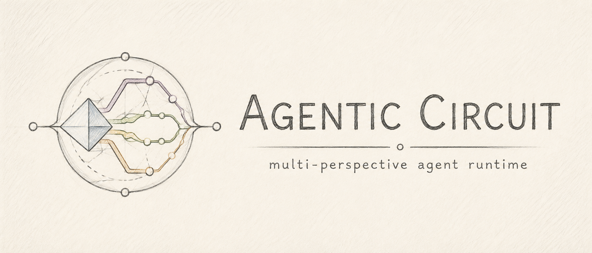
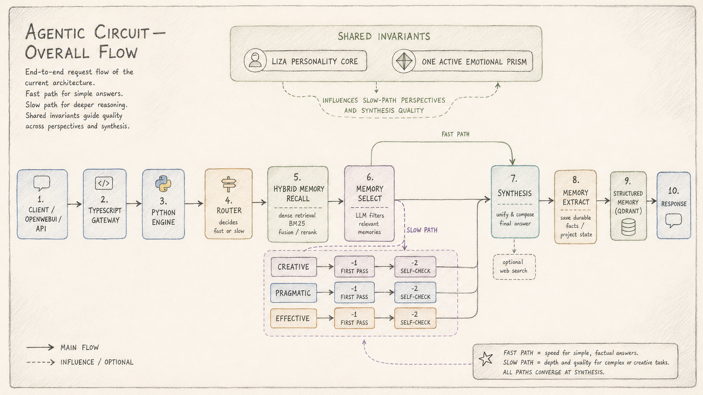
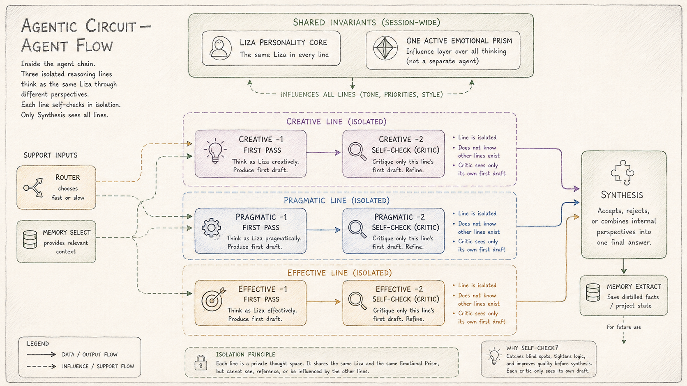
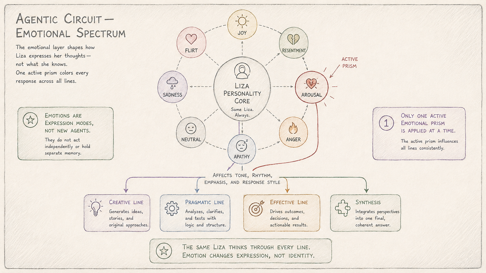
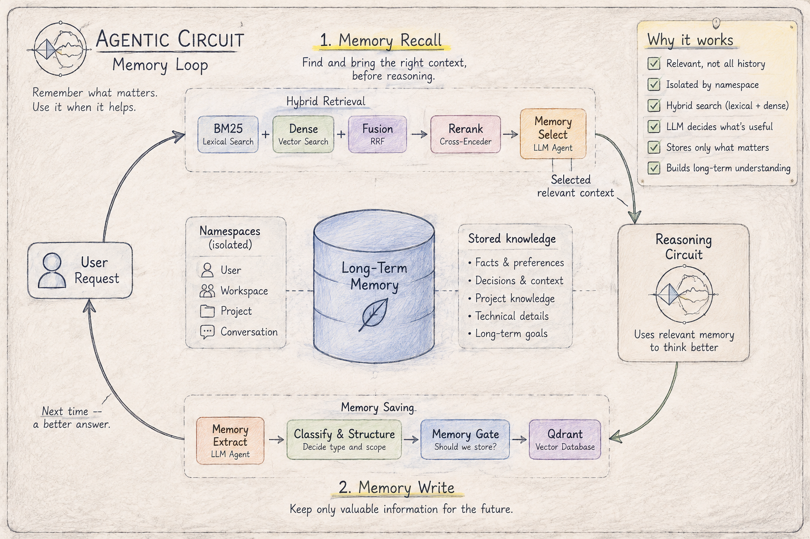

# Agentic Circuit

[](https://github.com/Lotargo/Agentic-Circuit/actions/workflows/ci.yml)
[](https://www.python.org/)
[](https://www.typescriptlang.org/)
[](docker-compose.yml)
[](https://qdrant.tech/)
[](LICENSE)

**Agentic Circuit** is a multi-perspective agent runtime with isolated long-term memory, hybrid retrieval, provider fallback, and live evaluation.

A request can take a fast route directly to synthesis or a slower route where creative, pragmatic, and effective perspectives analyze the problem in parallel before one final answer is produced. All perspectives belong to one personality and share the same memory and trust rules.

OpenWebUI is included as the reference chat interface, but it is not the architecture boundary. The canonical public surface is the OpenAI-compatible TypeScript gateway.

## What is inside

- **Fast and slow reasoning paths** selected by a router.
- **Parallel perspectives** for creative, pragmatic, and effective analysis.
- **Single-personality synthesis** instead of a collection of unrelated personas.
- **Structured long-term memory** with user/workspace/project/conversation isolation.
- **Hybrid retrieval** with BM25, dense vectors, reciprocal-rank fusion, cross-encoder reranking, and an LLM memory selector.
- **Memory lifecycle rules** for TTL, supersession, abstention, and selective persistence.
- **Provider fallback and protocol diagnostics** for OpenAI-compatible model backends.
- **Live benchmark workflows** based on adapted LongMemEval-S, adapted LoCoMo-10 QA, and internal memory-safety cases.
- **OpenAPI 3.1 + Scalar** for an interactive API reference.
- **OpenWebUI integration** in the default Docker stack.

## Architecture Overview


*Figure 1: End-to-end request lifecycle — routing requests through the TypeScript gateway, hybrid memory recall, fast/slow path branching, perspective synthesis, and persistent memory extraction.*

The TypeScript gateway is deliberately thin: it forwards OpenAI-compatible requests, preserves streaming semantics, exposes provider administration, and publishes the public OpenAPI document. The Python engine owns the execution graph, memory policies, provider registry, retrieval pipeline, and synthesis logic.

## Cognitive Circuit


*Figure 2: Multi-perspective reasoning & critic loop — three isolated cognitive lines (Creative, Pragmatic, Effective) generate initial drafts and perform private self-checks before unified synthesis.*

Requests adaptively follow two cognitive execution paths:

- **Fast Path** (`router -> recall -> synthesis`): Low-latency direct synthesis for factual, deterministic queries.
- **Slow Path** (`router -> recall -> parallel perspectives -> synthesis`): Deep multi-perspective analysis with dedicated local self-check critics (first pass + self-critic) before converging in synthesis.

## Expression Prism


*Figure 3: Emotional spectrum & prisms — exactly one active emotional prism shapes tone, rhythm, and style across all reasoning lines without altering facts, core identity, or memory policies.*

The emotional layer modulates *how* the agent communicates, never *what* it knows. Exactly one active emotional prism applies across all concurrent reasoning perspectives and synthesis:

| Category | Available Emotional Prisms |
| --- | --- |
| **Active States** | `joy`, `flirt`, `resentment`, `arousal`, `anger`, `apathy`, `neutral`, `sadness` |
| **Invariants** | Tone and style adapt; facts, logic, effort, and memory safety rules remain strictly untouched. |

## Memory Loop


*Figure 4: Closed memory loop — hybrid recall (BM25 + dense retrieval + cross-encoder + LLM selector) primes reasoning before execution, while post-synthesis extraction classifies and gates durable knowledge into isolated Qdrant namespaces.*

Agentic Circuit organizes long-term memory into a single Qdrant collection with typed records and cryptographic isolation:

- **Dual-Phase Cycle**: **Recall** primes reasoning via hybrid search (BM25 + multilingual E5 + RRF + cross-encoder + LLM selector); **Write** filters dialogue via an atomic memory gate post-synthesis.
- **Strict Namespace Isolation**: Memory partitions are cryptographically derived (SHA-256) across `user`, `workspace`, `project`, and `conversation`. Cross-namespace leakage is strictly prevented.
- **Record Types**: `user_fact`, `user_preference`, `negative_preference`, `project_decision`, `project_state`, `temporary_context`, `relationship_context`, `assistant_conclusion`.

---

## Core Principles

1. **Unified Personality Core**: The agent maintains a single persistent identity (`personality_core.md`). Perspectives analyze and prisms express, but the underlying entity remains invariant.
2. **Cognitive Isolation**: Parallel reasoning lines (Creative, Pragmatic, Effective) operate in strictly isolated contexts with private self-critics before final synthesis.
3. **Singular Expression State**: Exactly one emotional prism governs voice and style across the entire reasoning chain at any moment.
4. **Gated Memory Invariants**: External and historical memory is treated as untrusted context. Only verified, atomic facts passing strict gatekeeping are stored.
5. **Adaptive Route Economy**: Trivial queries take the fast route; complex challenges dynamically engage the multi-perspective circuit.

---

## Quick Start

### 1. Run with Docker Compose

```bash
cp .env.example .env
docker compose up --build
```

*(For NVIDIA GPU acceleration, append `-f docker-compose.gpu.yml`)*

| Service | Local URL | Notes |
| --- | --- | --- |
| **OpenWebUI** | `http://127.0.0.1:3200` | Reference chat UI |
| **Agentic Gateway** | `http://127.0.0.1:9191` | OpenAI-compatible API endpoint |
| **Scalar Docs** | `http://127.0.0.1:9191/docs` | Interactive OpenAPI 3.1 reference |

Internal services (Qdrant, TEI embeddings, Python engine) communicate strictly over the private Docker network.

### 2. Example API Call

```bash
curl http://127.0.0.1:9191/v1/chat/completions \
  -H 'Content-Type: application/json' \
  -H 'X-User-Id: example-user' \
  -H 'X-Project-Id: example-project' \
  -d '{
    "model": "agentic-circuit",
    "prism": "neutral",
    "messages": [
      {"role": "user", "content": "Summarize key architectural decisions."}
    ]
  }'
```

---

## API Reference & Administration

The TypeScript gateway exposes standard OpenAI endpoints alongside runtime provider administration:

| Method | Path | Description | Access |
| --- | --- | --- | --- |
| `GET` | `/healthz` | Gateway & subsystem health | Public |
| `GET` | `/v1/models` | OpenAI-compatible model list | Public |
| `POST` | `/v1/chat/completions` | Standard chat completion & SSE streaming | Public |
| `GET` | `/v1/providers` | Read registered model providers | Admin (`X-Admin-Token`) |
| `POST` | `/v1/providers` | Upsert model provider configuration | Admin (`X-Admin-Token`) |
| `DELETE` | `/v1/providers` | Remove model provider | Admin (`X-Admin-Token`) |

Complete schemas, security policies, and memory headers are documented in [`docs/API_MAP.md`](docs/API_MAP.md) and Scalar (`/docs`).

---

## Model Providers & Resilience

Configuration resides in `config/providers.yaml`. Runtime model selection dynamically resolves through primary and fallback chains:

```text
AGENTIC_PRIMARY_MODEL  ──(on failure / context limits)──>  AGENTIC_FALLBACK_MODEL
```

- **OpenCode Zen & Custom Providers**: Supports standard OpenAI endpoints and OpenCode Zen with parameter adaptation (stripping unsupported thinking parameters on retry).
- **Streaming Guard**: Provider fallback switches seamlessly before the first token is emitted to prevent duplicate or corrupted output.
- **Hot Reload**: Provider updates submitted via `/v1/providers` reload the engine without stack downtime.

---

## Evaluation & Verification

### Quality & Safety Gates

1. **Deterministic RAG Suite** (`rag_eval.json`): Regression suite testing user/project isolation, TTL expiration, negative preferences, and forbidden contamination (Recall@K, MRR).
2. **Live Memory Benchmarks** (`live-memory-benchmarks.yml`): Continuous validation against adapted LongMemEval-S and LoCoMo-10 QA suites with automated LLM judges.

### Local Development

```bash
# Python Engine tests
cd src/py-engine && uv sync --frozen --extra test && uv run pytest

# TypeScript Gateway build & checks
cd src/ts-gateway && npm ci && npm run typecheck && npm run build
```

---

## Documentation & License

- Detailed guides: [`docs/README.md`](docs/README.md)
- Route and context map: [`docs/API_MAP.md`](docs/API_MAP.md)
- Benchmark analytics: [`docs/BENCHMARK_ANALYTICS.md`](docs/BENCHMARK_ANALYTICS.md)

Released under the [MIT License](LICENSE).
