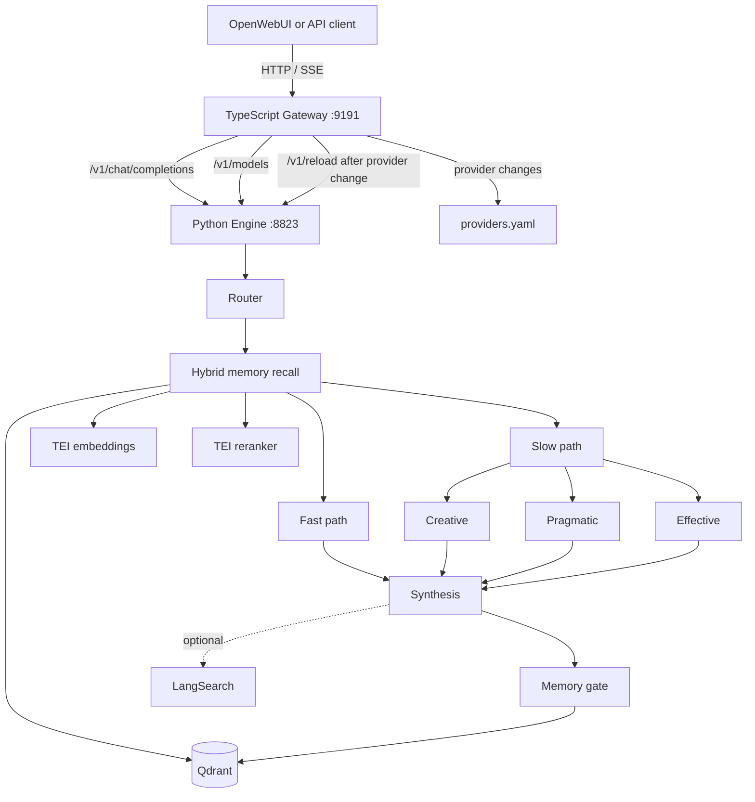

# Agentic Circuit API map

Agentic Circuit exposes one public HTTP surface through the TypeScript gateway. The Python LangGraph engine, Qdrant, and TEI sidecars are internal services in the default Docker topology.

## Public surface

Default local base URL:

```text
http://127.0.0.1:9191
```

Interactive API reference:

```text
GET /docs
```

OpenAPI 3.1 document:

```text
GET /openapi.json
```

### Routes

| Method | Path | Purpose | Authentication |
| --- | --- | --- | --- |
| `GET` | `/healthz` | Gateway health check | none |
| `GET` | `/v1/models` | OpenAI-compatible logical model list | none |
| `POST` | `/v1/chat/completions` | OpenAI-compatible chat completion endpoint | none at gateway level |
| `GET` | `/v1/providers` | Read provider configuration | admin token |
| `POST` | `/v1/providers` | Upsert a provider and reload the engine | admin token |
| `DELETE` | `/v1/providers?name=...` | Delete a provider and reload the engine | admin token |

Provider administration accepts either:

```text
X-Admin-Token: <PROVIDERS_ADMIN_TOKEN>
```

or:

```text
Authorization: Bearer <PROVIDERS_ADMIN_TOKEN>
```

If `PROVIDERS_ADMIN_TOKEN` is not configured, provider administration is disabled and returns HTTP `503`.

## Request context

`POST /v1/chat/completions` is OpenAI-compatible and also understands Agentic Circuit context fields.

### Request body extensions

| Field | Type | Meaning |
| --- | --- | --- |
| `prism` | string | Emotional expression lens. Defaults to `neutral`. |
| `memory` | boolean | Set to `false` to disable persistent memory for this request. |
| `project_id` | string | Project namespace used by long-term memory. |
| `conversation_id` | string | Conversation namespace used by temporary memory. |
| `metadata` | object | Alternative source for user/workspace/project/conversation context. |

Supported prisms:

```text
joy
flirt
resentment
arousal
anger
apathy
neutral
sadness
```

### Forwarded context headers

The gateway forwards the following headers to the Python engine when present:

```text
X-OpenWebUI-User-Id
X-User-Id
X-OpenWebUI-Instance-Id
X-OpenWebUI-Workspace-Id
X-Workspace-Id
X-Project-Id
X-OpenWebUI-Chat-Id
X-Conversation-Id
```

Raw identifiers are not stored in Qdrant. The Python engine converts identity and namespace inputs into SHA-256-derived opaque IDs before memory access.

## Runtime map



## Default Docker trust boundary

The default Compose file binds only these host ports:

```text
127.0.0.1:3200 -> OpenWebUI
127.0.0.1:9191 -> Agentic Circuit gateway + Scalar docs
```

The following services remain on the private Docker network and are not published to the host by default:

```text
Python engine
Qdrant REST/gRPC
TEI embedding service
TEI reranker service
```

This is intentional. The Python engine is an internal implementation service and does not provide its own authentication boundary. External deployments should place authentication, TLS, rate limiting, and network policy in front of the gateway rather than exposing internal service ports directly.

## Streaming

When `stream: true` is supplied to `/v1/chat/completions`, the gateway transparently proxies Server-Sent Events from the Python engine and preserves OpenAI-style `chat.completion.chunk` payloads followed by:

```text
data: [DONE]
```

Fallback to another provider is allowed only before the first output token is emitted, preventing duplicated responses after a stream has already started.

## Internal engine surface

These routes exist inside the Docker network on the Python engine and are not intended as the default public API:

| Method | Path | Purpose |
| --- | --- | --- |
| `GET` | `/healthz` | Engine/runtime health and memory initialization state |
| `GET` | `/v1/models` | Logical model declaration |
| `POST` | `/v1/chat/completions` | Engine implementation of chat completions |
| `POST` | `/v1/reload` | Reload provider/config registry and rebuild the graph |

The TypeScript gateway is the canonical public entry point and its `/openapi.json` document is the source used by Scalar at `/docs`.
